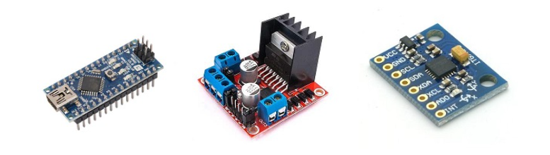
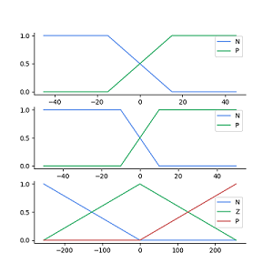

# EFLL-Balancing-Robot
This project focuses on the design and implementation of a two-wheel self-balancing robot utilizing `fuzzy logic control` through the [`Embedded Fuzzy Logic Library (eFLL)`](https://github.com/alvesoaj/eFLL).


## Project Goals
The primary objectives of this project are to:
- Design and build a functional two-wheel self-balancing robot.
- Develop and test a fuzzy logic control system for the robot's balancing act.
- Compare the performance of the `fuzzy logic control` system against a more commonly used `PID` control system for two-wheel self-balancing robots.

## Material

- **Arduino Nano**: Serves as the microcontroller for the robot.
- **3-6V TT DC Motors**: Provide the necessary propulsion for movement and balance.
- **L298N H-Bridge DC Motor Driver Module**: Controls the speed and direction of the DC motors.
- Isolation Columns, Acrylic Sheets, and Wheel/Gear Sets: Used for the robot's chassis and drive mechanism.

<div align="center">
    
</div>

### MPU6050
`MPU6050` is a crucial multi-function sensor integrated into the robot. It provides essential pose data, including acceleration and angular velocity, which are vital for maintaining balance. The MPU6050 outputs 14 bytes of sensor data (from registers `0x3B` to `0x48`), with two bytes representing each sensor's data. This includes three-axis accelerometer data, three-axis gyroscope data, and one temperature sensor reading. Raw data from the MPU6050 is communicated with the Arduino Nano via the `I2C` protocol.

```c
Wire.beginTransmission(address);
// Starting from register 0x3B -> ACCEL_XOUT_H
Wire.write(0x3B); 

// FS_SEL=0, Full_scale_Range= -/+ 250 degree/s
// RAW_DATA * FULL_SCALE_RANGE / 32768.0 -> Gravity Values
Wire.endTransmission(false);
Wire.requestFrom(address, 14, true);
accx = (Wire.read() << 8 | Wire.read());
accy = (Wire.read() << 8 | Wire.read());
accz = (Wire.read() << 8 | Wire.read());

// AFS_SEL=0, Full_Scale_Range = -/+ 2g
// RAW_DATA * FULL_SCALE_RANGE / 32768.0 -> Gravity Values
temp = (Wire.read() << 8 | Wire.read());
gyrx = (Wire.read() << 8 | Wire.read());
gyry = (Wire.read() << 8 | Wire.read());
gyrz = (Wire.read() << 8 | Wire.read());
```

### Embedded Fuzzy Logic Library
A key consideration for implementing our fuzzy logic control system is the compatibility of the chosen library with the microcontroller. It's important to note that Arduino microcontrollers cannot independently execute Python scripts. This limitation means that widely used Python libraries, such as `Scikit-Fuzzy`, are not directly deployable on the Arduino chip for real-time control.

To overcome this, we have opted to use [`eFLL (Embedded Fuzzy Logic Library)`](https://github.com/alvesoaj/eFLL). `eFLL` is a C/C++ based library specifically designed for embedded systems, allowing us to compile and directly execute our fuzzy logic control system on the Arduino Nano. 

## Methods
To ensure precise control, the raw data from the MPU6050 needs careful processing. Due to factors like gravitational acceleration and vibrations, the raw sensor readings often contain high-frequency noise, which can significantly hinder controller performance. Therefore, we implement `sensor fusion` techniques to filter and smooth the input signals before they reach the controller. Two common approaches for sensor fusion are the `Complementary Filter` and the `Kalman Filter`.

### Complementary Filter
The Complementary Filter cleverly combines the strengths of both `high-pass` and `low-pass` filters. It applies a low-pass filter to the accelerometer data to smooth out high-frequency noise caused by vibrations, while a high-pass filter is applied to the gyroscope data to mitigate its inherent low-frequency drift. By synergistically merging these filtered signals, we obtain a more accurate and stable pose estimate.

```cpp
float Complementary::update_(float acc_Angle, float gyro_Rate){
    pre_time = current_time; 
    current_time = millis(); 
    time_step = (current_time - pre_time) / 1000;
    current_angle = alpha * (gyro_Rate * time_step + pre_angle) + (1 - alpha) * acc_Angle;
    pre_angle = current_angle;
    return current_angle;
}
```

### Kalman Filter
The Kalman Filter is a powerful algorithm that simultaneously `estimates` the system state and `updates` its measurement based on the reliability of both the estimated value and the variation of the new measurement. It achieves this by intelligently weighing the current measurement against the predicted state, utilizing error covariance information to refine the overall estimate.

 ```cpp
double Kalman::update_(double new_value, double new_rate){
    dt = (double)(micros() - t) / 1e6;
    K_Rate = new_rate - K_Bias;
    K_Angle += K_Rate * dt;

    p[0][0] += (p[1][1] + p[0][1]+ Q_Angle ) * dt;
    p[0][1] -= p[1][1] * dt;
    p[1][0] -= p[1][1] * dt;
    p[1][1] += Q_Bias * dt;
    s = p[0][0] + R_Measure;
    k[0] = p[0][0] / s;
    k[1] = p[1][0] / s;

    y = new_value - K_Angle;
    K_Angle += k[0] * y;
    K_Bias += k[1] * y;

    p[0][0] -= k[0] * p[0][0];
    p[0][1] -= k[0] * p[0][1];
    p[1][0] -= k[1] * p[0][0];
    p[1][1] -= k[1] * p[0][1];

    t = (double)micros();
    return K_Angle;
}
 ```

After thorough testing, including initial calibration of both the accelerometer and gyroscope, we compared the smoothing effects of both filters. As illustrated in the figure below, the Kalman filter demonstrated superior performance, particularly in mitigating the gyroscope's inherent shift error. We believe that addressing this error is crucial for achieving stable and reliable robot operation, leading us to select the `Kalman filter` for our project.

<div align="center">
    
</div>

### Fuzzy Logic System
Our fuzzy logic system takes crisp input values and converts them into linguistic variables, which are then processed through a set of `IF-THEN` rules to determine the appropriate outputs. For a basic balancing robot, we found that two to three membership functions were sufficient. Specifically, we used `'N'(Negative)` and `'P'(Positive)` to represent the robot's pose relative to the vertical, and `'Z'(Zero)` when needed for a neutral or no-error situation.

<div align="center">
    
    
</div>

Consider an example: if the robot's angle is negative (leaning backward) and its angular velocity is also negative (tending to tilt further backward), the controller will output a positive PWM signal to the DC motors. This signal aims to drive the robot forward, bringing it back to its upright balancing position. Conversely, if the robot tilts to a positive angle (leaning forward) while still having a negative angular velocity (moving backward), we would expect the controller to adjust the motor output to bring it back to balance. The precise degree to which position, rate, and output signals are judged is determined by the shape and overlap of each membership function.

We experimented with several membership function configurations, as shown below. While our initial membership functions were relatively simple, we recognized that more nuanced control could be achieved by introducing additional linguistic degrees, such as `Slight` or `Severe` for both negative and positive conditions. This would allow for a more robust fuzzy logic control system capable of immediate and fine-tuned adjustments to the robot's pose.

<div align="center">
    
    
</div>

<div align="center">
    
    
</div>

It's worth noting that the [`Embedded Fuzzy Logic Library (eFLL)`]((https://github.com/alvesoaj/eFLL)) primarily supports `triangular` and `trapezoidal` membership functions. This limitation might restrict the controller's performance. Exploring the use of nonlinear membership functions, such as `Gaussian` functions, could potentially lead to superior balancing performance.

### MATLAB Simulink
To simulate and validate our robot's behavior, we utilized `MATLAB Simulink`. We designed a simplified model of a two-wheel robot, defining its core physical parameters, including `mass`, `inertia`, and a basic `damping factor` for the robot's "cart" (body). We also configured the necessary joints, such as the wheel shafts and the connection between the cart and the wheels, enabling the simulation to accurately capture angular changes, mimicking sensor feedback. This simulation environment allowed us to test and refine our control strategies in a virtual setting before physical implementation.

<div align="center" >
    
    
</div>

